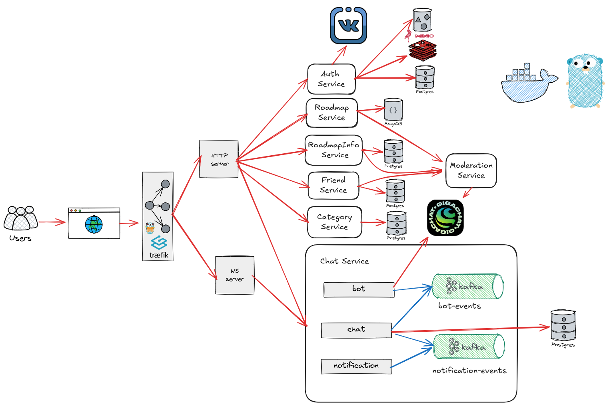

# ProfTwist

Backend приложения **ProfTwist** — выпускного проекта в Образовательном центре VK в МГТУ им. Н.Э. Баумана.

## Идея

Идея проекта — приложение для изучения новой профессии. Его основа — роадмапы, которые предлагают шаги для обучения. Каждый шаг — это навык, к которому прикрепляются обучающие материалы и чаты для обмена опытом. Пользователь получает пошаговые рекомендации, а также может найти в чате напарника и подключить его для совместного прохождения пути.

## Связанные репозитории

- [proftwist-frontend](https://github.com/F0urward/proftwist-frontend)

## Архитектура

## Стек

- **Язык:** Go
- **Базы данных:** PostgreSQL (пользователи, чаты, друзья, подписки), MongoDB (роадмапы и материалы), Redis (blacklist JWT)
- **Очереди и стриминг:** Kafka (broadcast сообщений, генерация сообщений ботом)
- **Объектное хранилище:** MinIO
- **Realtime:** WebSocket (чаты)
- **Интеграции:** GigaChat API (генерация роадмапов, модерация, бот в чатах), VK API (авторизация)
- **Инфраструктура:** Docker, Docker Compose, Traefik
