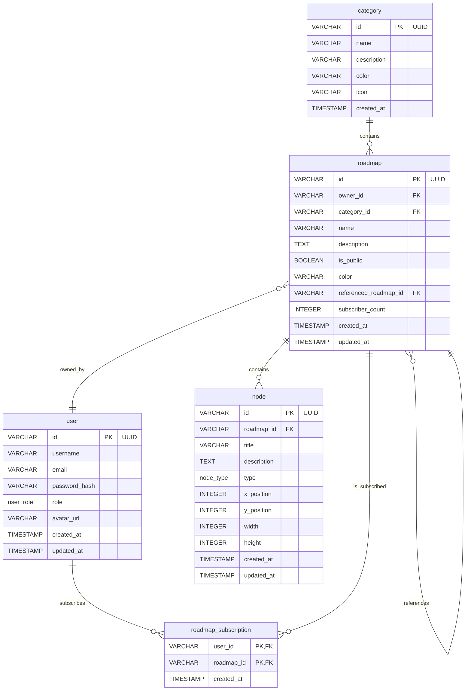

```mermaid
erDiagram
    user {
        VARCHAR id PK "UUID"
        VARCHAR username
        VARCHAR email
        VARCHAR password_hash
        user_role role
        VARCHAR avatar_url
        TIMESTAMP created_at
        TIMESTAMP updated_at
    }

    category {
        VARCHAR id PK "UUID"
        VARCHAR name
        VARCHAR description
        VARCHAR color
        VARCHAR icon
        TIMESTAMP created_at
    }

    roadmap {
        VARCHAR id PK "UUID"
        VARCHAR owner_id FK
        VARCHAR category_id FK
        VARCHAR name
        TEXT description
        BOOLEAN is_public
        VARCHAR color
        VARCHAR referenced_roadmap_id FK
        INTEGER subscriber_count
        TIMESTAMP created_at
        TIMESTAMP updated_at
    }

    node {
        VARCHAR id PK "UUID"
        VARCHAR roadmap_id FK
        VARCHAR title
        TEXT description
        node_type type
        INTEGER x_position
        INTEGER y_position
        INTEGER width
        INTEGER height
        TIMESTAMP created_at
        TIMESTAMP updated_at
    }

    roadmap_subscription {
        VARCHAR user_id PK,FK
        VARCHAR roadmap_id PK,FK
        TIMESTAMP created_at
    }

    category ||--o{ roadmap : contains
    roadmap ||--o{ node : contains
    roadmap }o--|| user : owned_by
    roadmap }o--|| roadmap : references
    user ||--o{ roadmap_subscription : subscribes
    roadmap ||--o{ roadmap_subscription : is_subscribed
```
