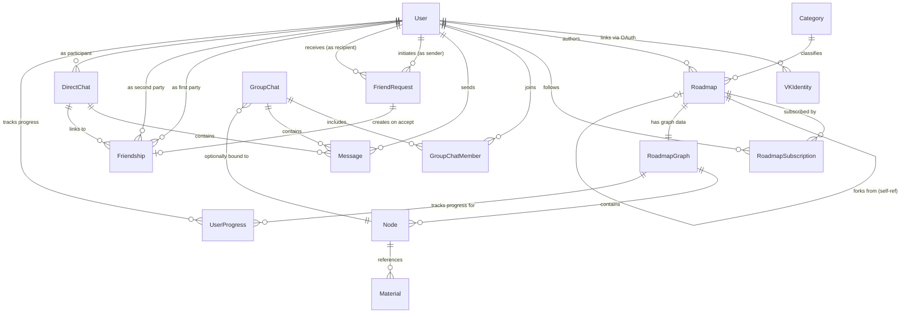

# Database ER Diagram

```mermaid
erDiagram
    %% ===================== ENUMS =====================
    %% user_role: 'admin', 'regular'
    %% chat_type: 'direct', 'group'
    %% member_role: 'owner', 'admin', 'member'
    %% friend_status: 'pending', 'accepted', 'rejected'

    %% =================== POSTGRESQL TABLES ===================

    user {
        uuid id PK
        text username "NOT NULL"
        text email "UNIQUE, NOT NULL"
        text password_hash "nullable"
        user_role role "default 'regular'"
        text avatar_url "nullable"
        timestamp created_at
        timestamp updated_at
    }

    vk_user {
        uuid id PK
        uuid user_id FK "UNIQUE, NOT NULL"
        text vk_user_id "UNIQUE, NOT NULL"
        text access_token "NOT NULL"
        text refresh_token "nullable"
        timestamp expires_at "NOT NULL"
        text device_id "nullable"
        timestamp created_at
        timestamp updated_at
    }

    category {
        uuid id PK
        text name "NOT NULL"
        text description "nullable"
        timestamp created_at
        timestamp updated_at
    }

    roadmap_info {
        uuid id PK
        text roadmap_id "NOT NULL, default hex"
        uuid author_id FK "NOT NULL"
        uuid category_id FK "nullable"
        text name "NOT NULL"
        text description "nullable"
        boolean is_public "default true"
        uuid referenced_roadmap_info_id FK "self-ref, nullable"
        timestamp created_at
        timestamp updated_at
    }

    roadmap_info_subscription {
        uuid id PK
        uuid user_id FK "NOT NULL"
        uuid roadmap_info_id FK "NOT NULL"
        timestamp created_at
        timestamp updated_at
    }

    group_chat {
        uuid id PK
        text title "nullable"
        text avatar_url "nullable"
        text roadmap_node_id "nullable"
        timestamp created_at
        timestamp updated_at
    }

    direct_chat {
        uuid id PK
        uuid user1_id FK "NOT NULL"
        uuid user2_id FK "NOT NULL"
        timestamp created_at
        timestamp updated_at
    }

    group_chat_members {
        uuid id PK
        uuid group_chat_id FK "NOT NULL"
        uuid user_id FK "NOT NULL"
    }

    group_chat_messages {
        uuid id PK
        uuid group_chat_id FK "NOT NULL"
        uuid user_id FK "NOT NULL"
        text content "NOT NULL"
        jsonb metadata "default '{}'"
        timestamp created_at
        timestamp updated_at
    }

    direct_chat_messages {
        uuid id PK
        uuid direct_chat_id FK "NOT NULL"
        uuid user_id FK "NOT NULL"
        text content "NOT NULL"
        jsonb metadata "default '{}'"
        timestamp created_at
        timestamp updated_at
    }

    friend_requests {
        uuid id PK
        uuid from_user_id FK "NOT NULL"
        uuid to_user_id FK "NOT NULL"
        friend_status status "default 'pending'"
        text message "nullable"
        timestamp created_at
        timestamp updated_at
    }

    friends {
        uuid id PK
        uuid user_id FK "NOT NULL"
        uuid friend_id FK "NOT NULL"
        uuid chat_id FK "nullable"
        timestamp created_at
    }

    %% =================== MONGODB COLLECTIONS ===================

    roadmaps_doc {
        object_id _id PK
        array nodes "RoadmapNode[]"
        array edges "RoadmapEdge[]"
        timestamp created_at
        timestamp updated_at
    }

    user_progress_doc {
        object_id _id PK
        uuid user_id
        object_id roadmap_id
        map progress "node_id -%gt; NodeProgress"
        timestamp created_at
        timestamp updated_at
    }

    %% =================== POSTGRES RELATIONSHIPS ===================

    user ||--o{ vk_user : "has"
    user ||--o{ roadmap_info : "authors"
    user ||--o{ roadmap_info_subscription : "subscribes"
    user ||--o{ group_chat_members : "member of"
    user ||--o{ group_chat_messages : "sends"
    user ||--o{ direct_chat_messages : "sends"
    user ||--o{ friend_requests : "sent (from_user_id)"
    user ||--o{ friend_requests : "received (to_user_id)"
    user ||--o{ friends : "as user_id"
    user ||--o{ friends : "as friend_id"
    user ||--o{ direct_chat : "as user1_id"
    user ||--o{ direct_chat : "as user2_id"

    category ||--o{ roadmap_info : "contains"
    roadmap_info ||--o{ roadmap_info_subscription : "subscribed"
    roadmap_info ||--o| roadmap_info : "references (self-ref)"

    group_chat ||--o{ group_chat_members : "has"
    group_chat ||--o{ group_chat_messages : "has"
    direct_chat ||--o{ direct_chat_messages : "has"
    direct_chat ||--o{ friends : "links to"

    %% =================== CROSS-DATABASE (LOGICAL) ===================
    %% roadmap_info (PG) -- roadmap_id/name -- roadmaps_doc (Mongo) via service layer
    %% user (PG) -- id -- user_progress_doc.user_id (Mongo) via service layer
    %% roadmaps_doc (Mongo) -- _id -- user_progress_doc.roadmap_id (Mongo)
    %% group_chat.roadmap_node_id (PG) --- roadmaps_doc.nodes[].id (Mongo)
```

---

# Logical Database Schema

> Conceptual view of the domain model, abstracted from physical storage details (data types, indexes, defaults).
> Shows entities, logical attributes, primary/foreign keys, business rules, and the polyglot storage mapping.

## Logical Entities

### 1. User (Account)

| Attribute | Logical Type | Constraint |
|-----------|-------------|------------|
| **user_id** | Identifier | PK |
| username | Text (unique) | NOT NULL |
| email | Text (unique) | NOT NULL |
| password_hash | Text | nullable (OAuth-only users) |
| role | Enum: Admin \| Regular | NOT NULL |
| avatar_url | URL | nullable |
| created_at | Timestamp | NOT NULL |
| updated_at | Timestamp | NOT NULL |

**Business rules:**
- User can register via email+password or via VK OAuth
- VK-linked accounts may have null `password_hash`
- Unique username and email across all users

### 2. VK Identity

| Attribute | Logical Type | Constraint |
|-----------|-------------|------------|
| **vk_identity_id** | Identifier | PK |
| **user_id** | Identifier (FK → User) | UNIQUE, NOT NULL |
| vk_user_id | Text | UNIQUE, NOT NULL |
| access_token | Text (secret) | NOT NULL |
| refresh_token | Text (secret) | nullable |
| expires_at | Timestamp | NOT NULL |
| device_id | Text | nullable |

**Business rules:**
- One User can have at most one VK Identity
- VK tokens are stored encrypted at rest

### 3. Category

| Attribute | Logical Type | Constraint |
|-----------|-------------|------------|
| **category_id** | Identifier | PK |
| name | Text | NOT NULL |
| description | Text | nullable |

**Business rules:**
- Categories classify roadmaps by topic (e.g., "Design", "Backend")

### 4. Roadmap

| Attribute | Logical Type | Constraint |
|-----------|-------------|------------|
| **roadmap_info_id** | Identifier | PK |
| roadmap_slug | Text (hex) | NOT NULL, unique per system |
| **author_id** | Identifier (FK → User) | NOT NULL |
| **category_id** | Identifier (FK → Category) | nullable |
| name | Text | NOT NULL |
| description | Text | nullable |
| is_public | Boolean | NOT NULL |
| **parent_roadmap_id** | Identifier (FK → Roadmap, self-ref) | nullable |
| created_at | Timestamp | NOT NULL |
| updated_at | Timestamp | NOT NULL |

**Business rules:**
- A Roadmap can optionally reference another Roadmap as a "fork" (parent)
- Roadmap metadata lives in PostgreSQL; graph structure lives in MongoDB
- Public roadmaps are discoverable via full-text search

### 5. Roadmap Subscription

| Attribute | Logical Type | Constraint |
|-----------|-------------|------------|
| **subscription_id** | Identifier | PK |
| **user_id** | Identifier (FK → User) | NOT NULL |
| **roadmap_info_id** | Identifier (FK → Roadmap) | NOT NULL |
| subscribed_at | Timestamp | NOT NULL |

**Business rules:**
- UNIQUE(user_id, roadmap_info_id) — a user subscribes to a roadmap at most once
- Subscribing follows a roadmap for updates

### 6. Roadmap Graph (MongoDB Document)

| Attribute | Logical Type | Constraint |
|-----------|-------------|------------|
| **doc_id** | ObjectId | PK |
| nodes | Collection of Node | embedded array |
| edges | Collection of Edge | embedded array |

**Node sub-entity:**

| Attribute | Logical Type | Constraint |
|-----------|-------------|------------|
| node_id | Identifier | unique within document |
| type | Text | NOT NULL |
| position | Point {x, y} | NOT NULL |
| label | Text | NOT NULL |
| description | Text | nullable |
| materials | Collection of Material | embedded array |

**Edge sub-entity:**

| Attribute | Logical Type | Constraint |
|-----------|-------------|------------|
| edge_id | Identifier | unique within document |
| source_node_id | Identifier | references Node |
| target_node_id | Identifier | references Node |

**Business rules:**
- Roadmap graph is linked to Roadmap metadata via `roadmap_slug` (application-level join)
- A Node can have zero or more Materials attached
- Edges define directed relationships between Nodes

### 7. Group Chat

| Attribute | Logical Type | Constraint |
|-----------|-------------|------------|
| **group_chat_id** | Identifier | PK |
| title | Text | nullable |
| avatar_url | URL | nullable |
| **roadmap_node_id** | Identifier | nullable, references Node |
| created_at | Timestamp | NOT NULL |

**Business rules:**
- A Group Chat can be linked to a Roadmap Node (discussion room for that node)
- Group Chats can also exist independently (not tied to any node)

### 8. Direct Chat

| Attribute | Logical Type | Constraint |
|-----------|-------------|------------|
| **direct_chat_id** | Identifier | PK |
| **participant_1_id** | Identifier (FK → User) | NOT NULL |
| **participant_2_id** | Identifier (FK → User) | NOT NULL |

**Business rules:**
- UNIQUE(participant_1_id, participant_2_id) — only one chat per user pair
- Order of participants is deterministic

### 9. Chat Member

| Attribute | Logical Type | Constraint |
|-----------|-------------|------------|
| **membership_id** | Identifier | PK |
| **group_chat_id** | Identifier (FK → Group Chat) | NOT NULL |
| **user_id** | Identifier (FK → User) | NOT NULL |

**Business rules:**
- UNIQUE(group_chat_id, user_id) — a user can only be added once to a group chat

### 10. Chat Message (polymorphic)

| Attribute | Logical Type | Constraint |
|-----------|-------------|------------|
| **message_id** | Identifier | PK |
| **chat_id** | Identifier (FK → Group Chat or Direct Chat) | NOT NULL |
| **author_id** | Identifier (FK → User) | NOT NULL |
| content | Text | NOT NULL |
| metadata | JSON (flexible) | nullable |
| sent_at | Timestamp | NOT NULL |

**Business rules:**
- Messages belong to exactly one chat (either Group or Direct)
- Metadata stores additional payload (e.g., file attachments, reply references)

### 11. Friend Request

| Attribute | Logical Type | Constraint |
|-----------|-------------|------------|
| **request_id** | Identifier | PK |
| **from_user_id** | Identifier (FK → User) | NOT NULL |
| **to_user_id** | Identifier (FK → User) | NOT NULL |
| status | Enum: Pending \| Accepted \| Rejected | NOT NULL |
| message | Text | nullable |

**Business rules:**
- UNIQUE(from_user_id, to_user_id) — only one pending request per direction
- Accepted requests create a bidirectional Friend relationship

### 12. Friendship

| Attribute | Logical Type | Constraint |
|-----------|-------------|------------|
| **friendship_id** | Identifier | PK |
| **user_id** | Identifier (FK → User) | NOT NULL |
| **friend_id** | Identifier (FK → User) | NOT NULL |
| **chat_id** | Identifier (FK → Direct Chat) | nullable |
| created_at | Timestamp | NOT NULL |

**Business rules:**
- UNIQUE(user_id, friend_id) — bidirectional; entry (A, B) implies (B, A) also exists
- Links to the auto-created Direct Chat between the two users

### 13. User Progress (MongoDB Document)

| Attribute | Logical Type | Constraint |
|-----------|-------------|------------|
| **doc_id** | ObjectId | PK |
| **user_id** | Identifier (FK → User) | indexed |
| **roadmap_doc_id** | ObjectId (FK → Roadmap Graph) | indexed |
| progress | Map{node_id → Status} | embedded document |

**Progress status values:**
- Pending (`ожидает`)
- In Progress (`в процессе`)
- Completed (`завершено`)
- Skipped (`пропущено`)

**Business rules:**
- One document per (user, roadmap) pair
- Tracks completion status for each Node in the roadmap

## Logical Relationships Diagram

## Data Flow Per Entity

| Domain Entity | Primary Store | Secondary / Cache | Rationale |
|---------------|---------------|-------------------|-----------|
| User + Auth | PostgreSQL | Redis (token blacklist) | ACID for accounts; fast token revocation |
| VK Identity | PostgreSQL | — | Referential integrity with User |
| Category | PostgreSQL | — | Rarely changes, referential integrity |
| Roadmap metadata | PostgreSQL | — | Relational queries, search, joins |
| Roadmap graph | MongoDB | — | Flexible schema for graph structure |
| User Progress | MongoDB | — | Key-value pattern: user_id+roadmap_id → progress map |
| Chat Messages | PostgreSQL | — | Relational queries (history, pagination) |
| Friendships | PostgreSQL | — | Relational integrity, bidirectional constraints |
| File uploads | MinIO / S3 | — | Binary blob storage, CDN-ready |

## Key Structural Principles

1. **Polyglot persistence** — relational data in PostgreSQL, document data in MongoDB, cache/state in Redis, blobs in S3
2. **No ORM** — raw SQL and MongoDB driver queries for full control
3. **UUID as primary key** — all PostgreSQL entities use UUID v4 (non-sequential, safe for distributed systems)
4. **Soft-referential across databases** — relationships between PG and MongoDB entities are enforced at the application layer, not by database constraints
5. **Audit timestamps** — every entity has `created_at` / `updated_at`
6. **Full-text search** — User (username) and Roadmap (name, description) have tsvector + GIN indexes for prefix search

## Storage Architecture

| Data | Store | Access |
|------|-------|--------|
| Accounts, auth, profiles | PostgreSQL | `database/sql` + `lib/pq` |
| Roadmap metadata (name, author, category, visibility) | PostgreSQL | Raw SQL |
| Roadmap graph data (nodes, edges, materials) | MongoDB | `go.mongodb.org/mongo-driver` |
| User progress on roadmap nodes | MongoDB | `go.mongodb.org/mongo-driver` |
| Group / direct chats & messages | PostgreSQL | Raw SQL |
| Friend requests & friendships | PostgreSQL | Raw SQL |
| Categories | PostgreSQL | Raw SQL |
| JWT blacklist / OAuth state | Redis | `go-redis/v9` |
| File uploads (avatars) | MinIO / S3 | `minio-go/v7` |
